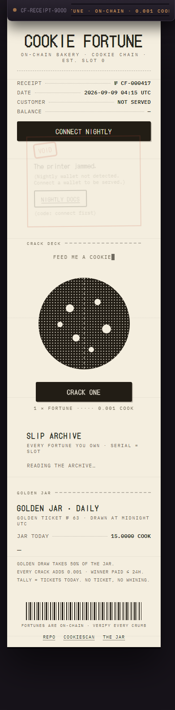
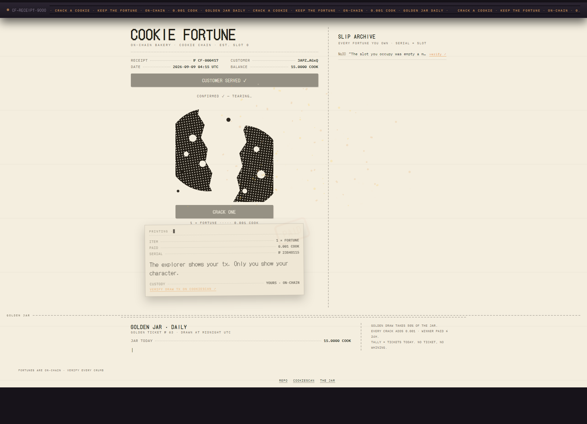
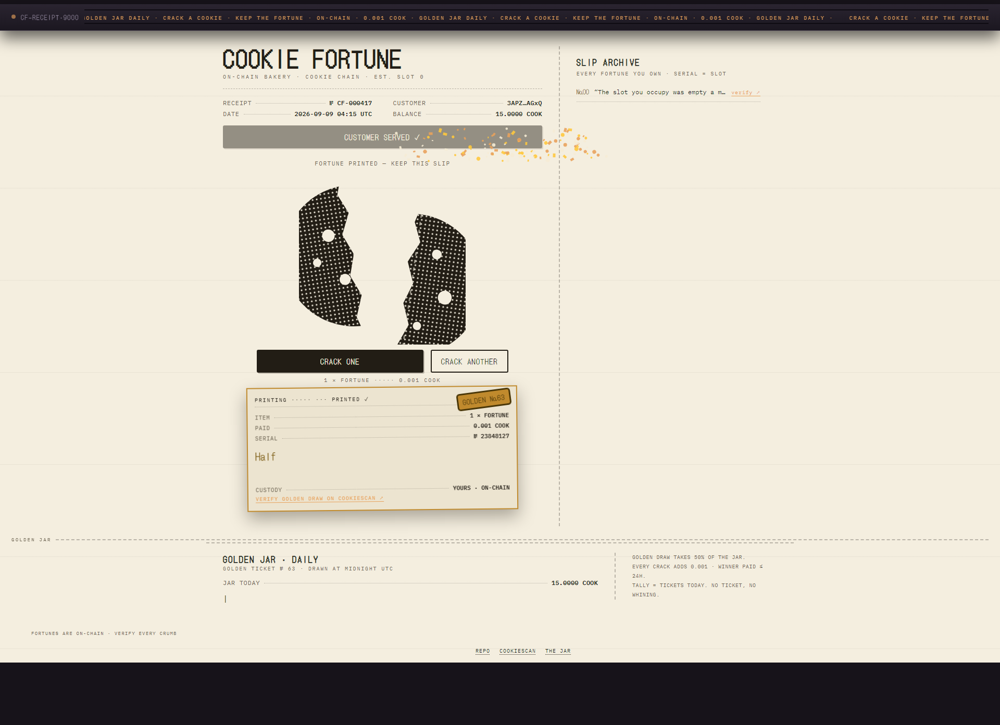

# Cookie Fortune

Crack a cookie, keep a fortune — every fortune is a real Cookie Chain transaction you can verify.

On-chain fortune cookies on Cookie Chain (SVM). Draw = 0.001 COOK to the jar + a Memo; fortune index = confirmed slot mod 64. Live at `https://blckr0se.github.io/cookie-fortune/` once Pages deploys.

Status: THE RECEIPT (design_v2) — receipt-paper UI over counter-dark world, GSAP keyed to real tx events.

## Screenshots

| Mobile idle (375) | Desktop crack (1440) | Golden reveal (1440) |
| --- | --- | --- |
|  |  |  |

## Dev

```
npm i
npm run dev      # http://localhost:5173/cookie-fortune/
npm run build    # outputs dist/
```

RPC: https://rpc.cookiescan.io · Explorer: https://cookiescan.io

## Disclosure

This app is AI-assisted: built with an autonomous agent (Hermes) driven by a human operator. All code and decisions reviewed by the operator before submission.
